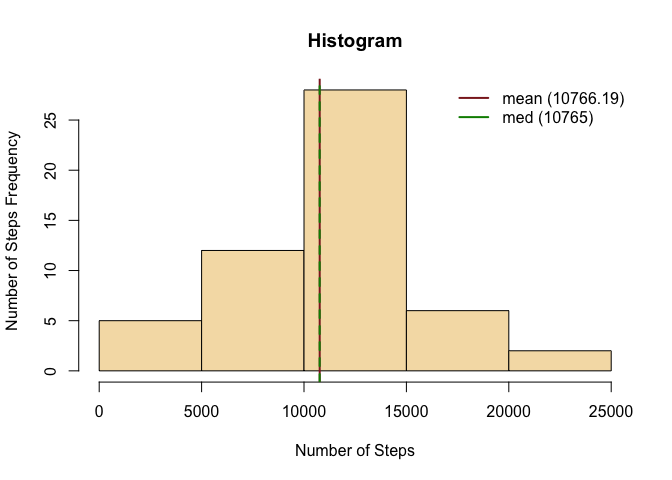
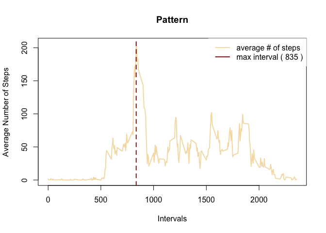
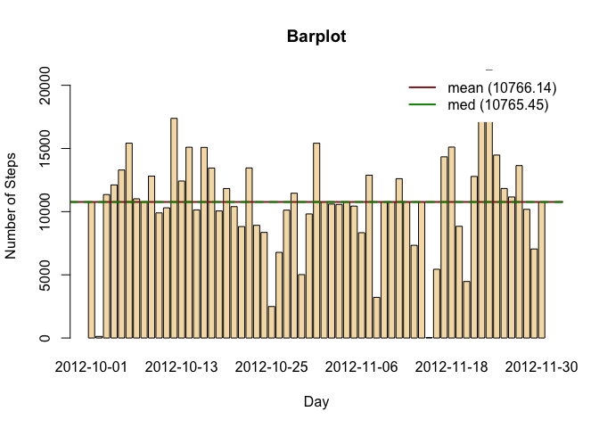
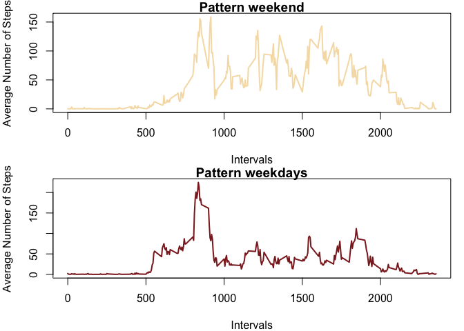

# Peer-graded Assignment: Course Project 1

## Introduction

It is now possible to collect a large amount of data about personal
movement using activity monitoring devices such as a Fitbit, Nike
Fuelband, or Jawbone Up. These type of devices are part of the
“quantified self” movement – a group of enthusiasts who take
measurements about themselves regularly to improve their health, to find
patterns in their behavior, or because they are tech geeks. But these
data remain under-utilized both because the raw data are hard to obtain
and there is a lack of statistical methods and software for processing
and interpreting the data.

This assignment makes use of data from a personal activity monitoring
device. This device collects data at 5 minute intervals through out the
day. The data consists of two months of data from an anonymous
individual collected during the months of October and November, 2012 and
include the number of steps taken in 5 minute intervals each day.

The data for this assignment can be downloaded from the course web site:

-   Dataset: [Activity monitoring
    data](https://d396qusza40orc.cloudfront.net/repdata%2Fdata%2Factivity.zip)
    \[52K\] The variables included in this dataset are:

-   **steps**: Number of steps taking in a 5-minute interval (missing
    values are coded as $\color{red}{\text{NA}}$)

-   **date**: The date on which the measurement was taken in YYYY-MM-DD
    format

-   **interval**: Identifier for the 5-minute interval in which
    measurement was taken The dataset is stored in a
    comma-separated-value (CSV) file and there are a total of 17,568
    observations in this dataset.

## Assignment

This assignment will be described in multiple parts. You will need to
write a report that answers the questions detailed below. Ultimately,
you will need to complete the entire assignment in a single R markdown
document that can be processed by knitr and be transformed into an HTML
file.

Throughout your report make sure you always include the code that you
used to generate the output you present. When writing code chunks in the
R markdown document, always use $\color{red}{\text{echo = TRUE}}$ so
that someone else will be able to read the code. This assignment will be
evaluated via peer assessment so it is essential that your peer
evaluators be able to review the code for your analysis.

For the plotting aspects of this assignment, feel free to use any
plotting system in R (i.e., base, lattice, ggplot2)

Fork/clone the [GitHub repository created for this
assignment](http://github.com/rdpeng/RepData_PeerAssessment1). You will
submit this assignment by pushing your completed files into your forked
repository on GitHub. The assignment submission will consist of the URL
to your GitHub repository and the SHA-1 commit ID for your repository
state.

NOTE: The GitHub repository also contains the dataset for the assignment
so you do not have to download the data separately.

### Loading and preprocessing the data

Show any code that is needed to 1. Load the data
(i.e. $\color{red}{\text{read.csv()}}$) 2. Process/transform the data
(if necessary) into a format suitable for your analysis

    if(!file.exists('./data')){
        dir.create('./data')
    }

    ## Download the zip file in the data folder
    zipFileName <- './data/Assignment1.zip'
    download.file('https://d396qusza40orc.cloudfront.net/repdata%2Fdata%2Factivity.zip',
                  zipFileName)

    ## Unzip the zip file in the data folder
    unzip(zipFileName ,exdir='data')

    ## Get the list of the .csv file names in the unzipped file
    csvFileNames <- list.files(path = "data", pattern = "\\.csv$")

    ## Read the first .csv file from the unzipped file as a data frame
    df <- read.csv(paste('./data/', csvFileNames[1], sep = ''))

    ## Check the short description and the head of the file 
    str(df)

    ## 'data.frame':    17568 obs. of  3 variables:
    ##  $ steps   : int  NA NA NA NA NA NA NA NA NA NA ...
    ##  $ date    : chr  "2012-10-01" "2012-10-01" "2012-10-01" "2012-10-01" ...
    ##  $ interval: int  0 5 10 15 20 25 30 35 40 45 ...

    head(df)

    ##   steps       date interval
    ## 1    NA 2012-10-01        0
    ## 2    NA 2012-10-01        5
    ## 3    NA 2012-10-01       10
    ## 4    NA 2012-10-01       15
    ## 5    NA 2012-10-01       20
    ## 6    NA 2012-10-01       25

### What is mean total number of steps taken per day?

For this part of the assignment, you can ignore the missing values in
the dataset.

1.  Calculate the total number of steps taken per day

<!-- -->

    dfAgg <- aggregate(steps ~ date, data = df, sum, na.rm = T)
    head(dfAgg)

    ##         date steps
    ## 1 2012-10-02   126
    ## 2 2012-10-03 11352
    ## 3 2012-10-04 12116
    ## 4 2012-10-05 13294
    ## 5 2012-10-06 15420
    ## 6 2012-10-07 11015

1.  If you do not understand the difference between a histogram and a
    barplot, research the difference between them. Make a histogram of
    the total number of steps taken each day.

<!-- -->

    hist(dfAgg$steps, 
         col = 'wheat',
         xlab = 'Number of Steps', ylab = 'Number of Steps Frequency', 
         main = "Histogram")
    abline(v = mean(dfAgg$steps), lwd = 2, lty = 1, col = 'brown4')
    abline(v = median(dfAgg$steps), lwd = 2, lty = 2, col = 'green4')
    legend("topright", box.col = "white",
           legend = c(paste('mean (', round(mean(dfAgg$steps), 2), ')', sep = ''), 
                      paste('med (', round(median(dfAgg$steps), 2), ')', sep = '')),
            lwd = 2, col = c("brown4", "green4"))

1.  Calculate and report the mean and median of the total number of
    steps taken per day

<!-- -->

    print(paste('Mean steps per day: ', round(mean(dfAgg$steps), 3),'. Median steps per day: ', round(median(dfAgg$steps, 3))))

    ## [1] "Mean steps per day:  10766.189 . Median steps per day:  10765"

### What is the average daily activity pattern?

1.  Make a time series plot (i.e. $\color{red}{\text{type = "l"}}$) of
    the 5-minute interval (x-axis) and the average number of steps
    taken, averaged across all days (y-axis).

<!-- -->

    dfAggIn <- aggregate(steps ~ interval, data = df, mean, na.rm = T)
    maxInterval <- dfAggIn$interval[which.max(dfAggIn$steps)]

    plot(dfAggIn$interval, dfAggIn$steps, 
         type = 'l', col = 'wheat', lwd = 2, 
         xlab = 'Intervals', ylab = 'Average Number of Steps', 
         main = "Pattern")
    abline(v = maxInterval, lwd = 2, lty = 2, col = 'brown4')
    legend("topright", box.col = "white",
           legend = c('average # of steps', 
                      paste('max interval (',maxInterval,')')),
           lwd = 2, col = c('wheat', 'brown4'))

1.  Which 5-minute interval, on average across all the days in the
    dataset, contains the maximum number of steps?

<!-- -->

    print(paste('Interval corresponding to max val:', maxInterval))

    ## [1] "Interval corresponding to max val: 835"

### Imputing missing values

Note that there are a number of days/intervals where there are missing
values (coded as $\color{red}{\text{NA}}$). The presence of missing days
may introduce bias into some calculations or summaries of the data.

1.  Calculate and report the total number of missing values in the
    dataset (i.e. the total number of rows with
    $\color{red}{\text{NA}}$s)

<!-- -->

    naCount <- sum(apply(is.na(df),2,sum))
    print(paste('Total number of missing values in data frame:', naCount))

    ## [1] "Total number of missing values in data frame: 2304"

1.  Devise a strategy for filling in all of the missing values in the
    dataset. The strategy does not need to be sophisticated. For
    example, you could use the mean/median for that day, or the mean for
    that 5-minute interval, etc.

<!-- -->

    The strategy is considering the 5-minutes interval mean for filling the missing values.
    See the code in the next cell.

1.  Create a new dataset that is equal to the original dataset but with
    the missing data filled in.

<!-- -->

    meanStepsInterval <- dfAggIn$steps
    dfNew <- df
    dfNew$steps[which(is.na(df$steps))] <- meanStepsInterval[which(is.na(df$steps))%%288]
    head(dfNew)

    ##       steps       date interval
    ## 1 1.7169811 2012-10-01        0
    ## 2 0.3396226 2012-10-01        5
    ## 3 0.1320755 2012-10-01       10
    ## 4 0.1509434 2012-10-01       15
    ## 5 0.0754717 2012-10-01       20
    ## 6 2.0943396 2012-10-01       25

1.  Make a histogram of the total number of steps taken each day and
    calculate and report the mean and median total number of steps taken
    per day. Do these values differ from the estimates from the first
    part of the assignment? What is the impact of imputing missing data
    on the estimates of the total daily number of steps?

<!-- -->

    dfNewAgg <- aggregate(steps ~ date, data = dfNew, sum, na.rm = T)

    barplot(dfNewAgg$steps, names.arg = dfNewAgg$date,
            col = 'wheat',
            xlab = 'Day', ylab = 'Number of Steps', 
            main = "Barplot")
    abline(h = mean(dfNewAgg$steps), lwd = 2, lty = 1, col = 'brown4')
    abline(h = median(dfNewAgg$steps), lwd = 2, lty = 2, col = 'green4')
    legend("topright", box.col = "white",
           legend = c(paste('mean (', round(mean(dfNewAgg$steps), 2), ')', sep = ''), 
                      paste('med (', round(median(dfNewAgg$steps), 2), ')', sep = '')),
           lwd = 2, col = c("brown4", "green4"))

    print(paste('Mean steps per day:', round(mean(dfNewAgg$steps), 2), '. Median steps per day:', round(median(dfNewAgg$steps), 2)))

    ## [1] "Mean steps per day: 10766.14 . Median steps per day: 10765.45"

    meanInputeImpact = abs(round(mean(dfNewAgg$steps) / mean(dfAgg$steps), 6) - 1)
    medianInputeImpact = abs(round(median(dfNewAgg$steps) / median(dfAgg$steps), 6) - 1)

    print(paste('Mean impact of imputing missing steps per day:', meanInputeImpact, '. Median impact of imputing missing steps per day:', medianInputeImpact))

    ## [1] "Mean impact of imputing missing steps per day: 4.000000000004e-06 . Median impact of imputing missing steps per day: 4.20000000000975e-05"

### Are there differences in activity patterns between weekdays and weekends?

For this part the $\color{red}{\text{weekdays()}}$ function may be of
some help here. Use the dataset with the filled-in missing values for
this part.

1.  Create a new factor variable in the dataset with two levels –
    “weekday” and “weekend” indicating whether a given date is a weekday
    or weekend day.

2.  Make a panel plot containing a time series plot
    (i.e. $\color{red}{\text{type = "l"}}$) of the 5-minute interval
    (x-axis) and the average number of steps taken, averaged across all
    weekday days or weekend days (y-axis). See the README file in the
    GitHub repository to see an example of what this plot should look
    like using simulated data.

<!-- -->

    dfNew$weekend <- factor(weekdays(strptime(dfNew$date, '%Y-%m-%d', tz = 'EST'), 
                                  abbr = TRUE) %in% c('Sat', 'Sun'))

    dfNewAgg <- aggregate(steps ~ interval + weekend, data = dfNew, mean, na.rm = T)

    # plot(subset(dfNewAgg, weekend == TRUE)$interval,
    #      subset(dfNewAgg, weekend == TRUE)$steps,
    #      type = 'l', col = 'wheat', lwd = 2, 
    #      xlab = 'Intervals', ylab = 'Average Number of Steps', 
    #      main = "Pattern")
    # lines(subset(dfNewAgg, weekend == FALSE)$interval,
    #      subset(dfNewAgg, weekend == FALSE)$steps,
    #      type = 'l', col = 'brown4', lwd = 2)
    # legend("topright", box.col = "white",
    #        legend = c('weekend','weekdays'),
    #        lwd = 2, col = c("wheat", "brown4"))

    par(mfrow=c(2,1), mar = c(4,4,1,1))
    plot(subset(dfNewAgg, weekend == TRUE)$interval,
         subset(dfNewAgg, weekend == TRUE)$steps,
         type = 'l', col = 'wheat', lwd = 2, 
         xlab = 'Intervals', ylab = 'Average Number of Steps', 
         main = "Pattern weekend")
    plot(subset(dfNewAgg, weekend == FALSE)$interval,
         subset(dfNewAgg, weekend == FALSE)$steps,
         type = 'l', col = 'brown4', lwd = 2,
         xlab = 'Intervals', ylab = 'Average Number of Steps', 
         main = "Pattern weekdays")

## Submitting the Assignment

To submit the assignment:

1.  Commit your completed $\color{red}{\text{PA1\_template.Rmd}}$ file
    to the $\color{red}{\text{master}}$ branch of your git repository
    (you should already be on the $\color{red}{\text{master}}$ branch
    unless you created new ones).

2.  Commit your PA1\_template.md and PA1\_template.html files produced
    by processing your R markdown file with knit2html() function in R
    (from the knitr package) by running the function from the console.

3.  If your document has figures included (it should) then they should
    have been placed in the figure/ directory by default (unless you
    overrided the default). Add and commit the figure/ directory to your
    git repository so that the figures appear in the markdown file when
    it displays on github.

4.  Push your $\color{red}{\text{master}}$ branch to GitHub.

5.  Submit the URL to your GitHub repository for this assignment on the
    course web site.

In addition to submitting the URL for your GitHub repository, you will
need to submit the 40 character SHA-1 hash (as string of numbers from
0-9 and letters from a-f) that identifies the repository commit that
contains the version of the files you want to submit. You can do this in
GitHub by doing the following

1.  Going to your GitHub repository web page for this assignment
2.  Click on the “?? commits” link where ?? is the number of commits you
    have in the repository. For example, if you made a total of 10
    commits to this repository, the link should say “10 commits”.
3.  You will see a list of commits that you have made to this
    repository. The most recent commit is at the very top. If this
    represents the version of the files you want to submit, then just
    click the “copy to clipboard” button on the right hand side that
    should appear when you hover over the SHA-1 hash. Paste this SHA-1
    hash into the course web site when you submit your assignment. If
    you don’t want to use the most recent commit, then go down and find
    the commit you want and copy the SHA-1 hash.
